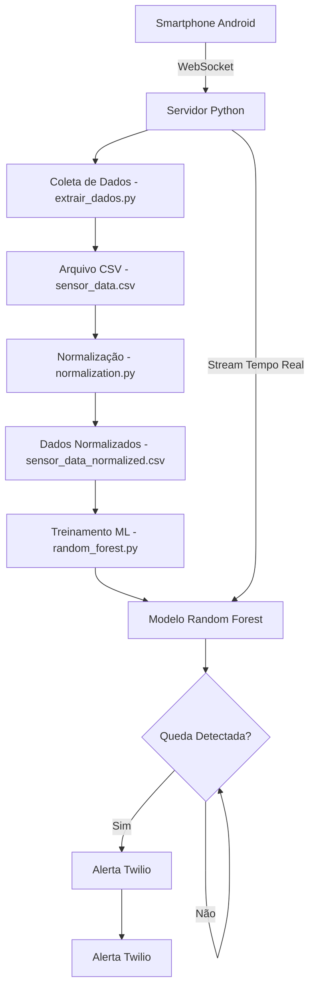
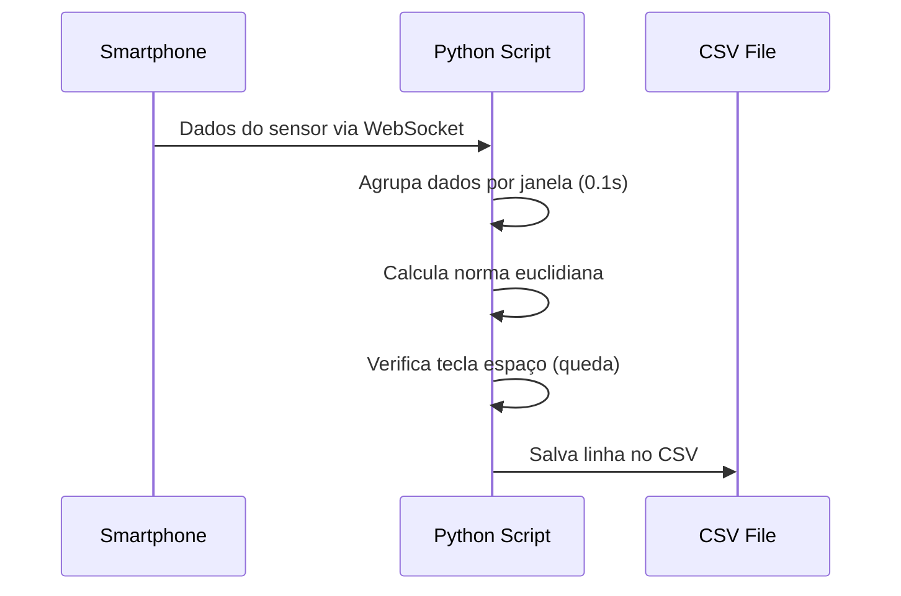
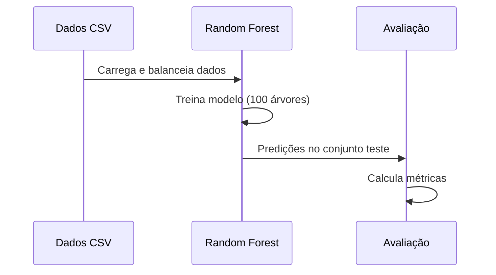
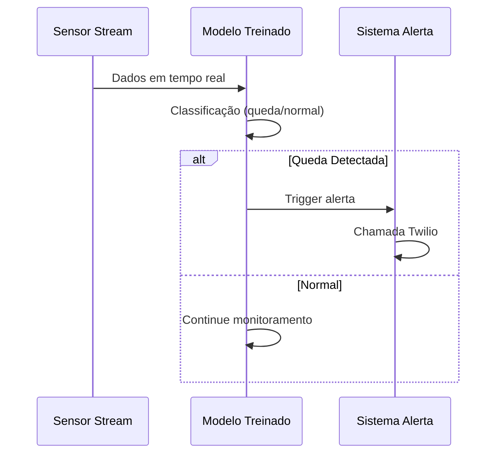

# Sistema de Detecção de Quedas Baseado em Smartphone para Idosos

## Visão Geral

Este projeto implementa um sistema inteligente de detecção de quedas para idosos utilizando sensores de smartphones Android. O sistema coleta dados de múltiplos sensores, processa-os usando machine learning e emite alertas automáticos quando uma queda é detectada.

## Arquitetura do Sistema



## Tecnologias Utilizadas

### Backend Python
- **Python 3.x**: Linguagem principal
- **pandas**: Manipulação e análise de dados
- **scikit-learn**: Machine learning (Random Forest)
- **numpy**: Computação numérica
- **websocket-client**: Comunicação WebSocket
- **pynput**: Captura de eventos do teclado
- **twilio**: Integração para chamadas telefônicas

### Sensores Android
- **Acelerômetro**: Detecta mudanças na aceleração (3 eixos)
- **Giroscópio**: Mede velocidade angular (3 eixos)
- **Campo Magnético**: Orientação magnética (3 eixos)
- **Gravidade**: Força gravitacional (3 eixos)
- **Aceleração Linear**: Aceleração sem gravidade (3 eixos)
- **Vetor de Rotação**: Orientação do dispositivo (5 valores)

### Algoritmos
- **Random Forest Classifier**: Algoritmo principal de detecção
- **Normalização Min-Max**: Pré-processamento de dados
- **Balanceamento de Classes**: Para melhor performance

## Estrutura do Projeto

```
smartphone-based-fall-detection/
├── extrair_dados.py          # Coleta de dados dos sensores
├── normalization.py          # Normalização dos dados
├── random_forest.py          # Treinamento e detecção em tempo real
├── sensor_data.csv          # Dados brutos dos sensores
├── sensor_data_normalized.csv # Dados normalizados (gerado)
└── README.md               # Documentação básica
```

## Funcionalidades Detalhadas por Arquivo

### 1. extrair_dados.py - Coleta de Dados

**Funcionalidades:**
- Conecta via WebSocket ao smartphone Android
- Coleta dados de 6 tipos de sensores simultaneamente
- Implementa janela temporal de 0.1 segundos para sincronização
- Anotação manual de quedas via tecla espaço
- Salva dados em formato CSV com timestamp

**Principais Componentes:**
```python
# Sensores monitorados
SENSOR_TYPES = [
    "android.sensor.accelerometer",      # Acelerômetro (3 valores)
    "android.sensor.gyroscope",          # Giroscópio (3 valores)
    "android.sensor.magnetic_field",     # Campo magnético (3 valores)
    "android.sensor.gravity",            # Gravidade (3 valores)
    "android.sensor.linear_acceleration", # Aceleração linear (3 valores)
    "android.sensor.rotation_vector",    # Vetor rotação (5 valores)
]
```

**Processo de Coleta:**
1. Estabelece conexão WebSocket
2. Recebe dados JSON dos sensores
3. Agrupa dados por janela temporal
4. Calcula norma euclidiana dos valores
5. Anota quedas baseado na tecla espaço pressionada
6. Salva no arquivo `sensor_data.csv`

**Formato de Saída CSV:**
```csv
timestamp,accelerometer_x,accelerometer_y,accelerometer_z,gyroscope_x,gyroscope_y,gyroscope_z,magnetic_field_x,magnetic_field_y,magnetic_field_z,gravity_x,gravity_y,gravity_z,linear_acceleration_x,linear_acceleration_y,linear_acceleration_z,rotation_vector_0,rotation_vector_1,rotation_vector_2,rotation_vector_3,rotation_vector_4,norm,falling
```

### 2. normalization.py - Normalização de Dados

**Funcionalidades:**
- Normalização Min-Max de todas as features
- Preserva timestamp e labels de queda
- Calcula norma global normalizada
- Trata valores ausentes ou inválidos

**Processo de Normalização:**
1. Identifica colunas para normalização (exclui timestamp, norm, falling)
2. Calcula valores mínimos e máximos para cada feature
3. Aplica normalização: `(valor - min) / (max - min)`
4. Calcula norma global: `√(Σ(valor_normalizado²))`
5. Salva em `sensor_data_normalized.csv`

**Colunas Excluídas da Normalização:**
- `timestamp`: Informação temporal
- `norm`: Norma original já calculada
- `falling`: Label de classificação
- `android.sensor.rotation_vector_value_4`: Valor constante (-1.0)

### 3. random_forest.py - Machine Learning e Detecção

**Funcionalidades Principais:**
- Treinamento do modelo Random Forest
- Balanceamento automático de classes
- Detecção em tempo real
- Sistema de alertas via Twilio
- Avaliação de performance

**Configuração do Modelo:**
```python
clf = RandomForestClassifier(
    n_estimators=100,        # 100 árvores
    random_state=42,         # Reprodutibilidade
    class_weight='balanced'  # Balanceamento automático
)
```

**Pipeline de Treinamento:**
1. Carrega dados do CSV
2. Balanceia classes (mesmo número de quedas e não-quedas)
3. Separa features e labels
4. Divide em treino/teste (70%/30%)
5. Treina Random Forest
6. Avalia performance (matriz confusão, relatório classificação)

**Detecção em Tempo Real:**
1. Conecta ao stream WebSocket
2. Processa dados em janelas de 0.1s
3. Aplica modelo treinado
4. Emite alerta se queda detectada
5. Integração opcional com Twilio para chamadas

**Sistema de Alertas Twilio:**
```python
def make_call_alert():
    call = twilio_client.calls.create(
        twiml='<Response><Say voice="alice" language="pt-BR">Alerta de queda detectada!</Say></Response>',
        to=TO_PHONE,
        from_=FROM_PHONE,
    )
```

### 4. sensor_data.csv - Dados Coletados

**Estrutura dos Dados:**
- **22 colunas totais**: 1 timestamp + 20 features de sensores + 1 norma + 1 label
- **Frequência**: ~10Hz (janelas de 0.1s)
- **Features por Sensor**:
  - Acelerômetro: 3 valores (X, Y, Z em m/s²)
  - Giroscópio: 3 valores (X, Y, Z em rad/s)
  - Campo Magnético: 3 valores (X, Y, Z em μT)
  - Gravidade: 3 valores (X, Y, Z em m/s²)
  - Aceleração Linear: 3 valores (X, Y, Z em m/s²)
  - Vetor Rotação: 5 valores (quaternion + estimativa acurácia)

## Instalação e Configuração

### Pré-requisitos
- Python 3.7+
- Smartphone Android com sensores
- Rede Wi-Fi compartilhada
- Conta Twilio (opcional, para alertas)

### Instalação das Dependências
```bash
# Instalar bibliotecas necessárias
pip install websocket-client pynput scikit-learn pandas numpy twilio

# Verificar instalação
python -c "import pandas, sklearn, numpy, websocket; print('Dependências OK')"
```

### Configuração do Smartphone Android
1. Instalar aplicativo de streaming de sensores
2. Configurar para transmitir via WebSocket
3. Conectar à mesma rede Wi-Fi do servidor Python
4. Configurar URL do servidor (ex: `ws://192.168.1.100:8080`)

### Configuração do Twilio (Opcional)
```python
# Em random_forest.py, substitua:
account_sid = "SEU_ACCOUNT_SID_TWILIO"
auth_token = "SEU_AUTH_TOKEN_TWILIO"
TO_PHONE = "+5511999999999"      # Telefone do cuidador
FROM_PHONE = "+5511888888888"    # Número Twilio
```

## Como Usar o Sistema

### Fase 1: Coleta de Dados de Treinamento
```bash
# 1. Iniciar coleta de dados
python extrair_dados.py

# 2. Realizar atividades normais e simulações de queda
# - Pressionar ESPAÇO durante quedas simuladas
# - Manter pressionado durante toda a queda
# - Soltar após a queda terminar

# 3. Coletar pelo menos 100 amostras de cada classe
```

### Fase 2: Pré-processamento (Opcional)
```bash
# Normalizar dados coletados
python normalization.py
```

### Fase 3: Treinamento e Detecção
```bash
# Treinar modelo e iniciar detecção em tempo real
python random_forest.py
```

## Métricas de Performance

O sistema avalia performance usando:
- **Matriz de Confusão**: Verdadeiros/falsos positivos e negativos
- **Precision**: Precisão na detecção de quedas
- **Recall**: Sensibilidade para detectar todas as quedas
- **F1-Score**: Média harmônica entre precision e recall

Exemplo de saída:
```
Confusion Matrix:
[[85  5]
 [ 3 87]]

Classification Report:
              precision    recall  f1-score   support
           0       0.97      0.94      0.95        90
           1       0.95      0.97      0.96        90
    accuracy                           0.96       180
```

## Fluxo de Processamento Detalhado

### 1. Coleta de Dados


### 2. Treinamento do Modelo


### 3. Detecção em Tempo Real


## Configurações Avançadas

### Ajuste de Sensibilidade
```python
# Em random_forest.py, ajustar threshold de confiança
confidence_threshold = 0.7  # 70% de confiança mínima
if clf.predict_proba(X_live)[0][1] > confidence_threshold:
    # Emitir alerta
```

### Customização de Janela Temporal
```python
# Em extrair_dados.py e random_forest.py
WINDOW_SIZE = 0.2  # Aumentar para 200ms (mais estável)
```

### Filtros Adicionais
```python
# Adicionar filtro de magnitude mínima
MIN_ACCELERATION = 15.0  # m/s²
if current_norm > MIN_ACCELERATION and prediction == 1:
    # Emitir alerta apenas se aceleração alta
```

## Resolução de Problemas

### Problemas Comuns

1. **Conexão WebSocket falhando**
   - Verificar IP do servidor
   - Confirmar mesma rede Wi-Fi
   - Testar conectividade: `ping IP_SERVIDOR`

2. **Modelo com baixa precisão**
   - Coletar mais dados de treinamento
   - Balancear melhor as classes
   - Ajustar hiperparâmetros do Random Forest

3. **Muitos falsos positivos**
   - Aumentar threshold de confiança
   - Adicionar filtros de magnitude
   - Coletar mais dados de atividades normais

4. **Alertas Twilio não funcionando**
   - Verificar credenciais
   - Confirmar saldo da conta
   - Testar números de telefone

### Logs e Debug
```python
# Adicionar logs detalhados
import logging
logging.basicConfig(level=logging.DEBUG)
logger = logging.getLogger(__name__)

# Em cada função crítica
logger.debug(f"Dados recebidos: {data}")
logger.info(f"Predição: {prediction}")
```

## Extensões Futuras

### Melhorias Sugeridas
1. **Interface Web**: Dashboard para monitoramento
2. **Histórico**: Banco de dados para armazenar eventos
3. **Multi-usuário**: Suporte a múltiplos idosos
4. **GPS**: Localização em alertas
5. **Sensores Adicionais**: Câmera, microfone
6. **Deep Learning**: Redes neurais para melhor precisão

### Integração com IoT
```python
# Exemplo de integração com outros dispositivos
def send_to_iot_platform(fall_data):
    # Enviar para AWS IoT, Azure IoT, etc.
    payload = {
        'timestamp': fall_data['timestamp'],
        'user_id': 'elderly_001',
        'location': get_gps_location(),
        'confidence': fall_data['confidence']
    }
    iot_client.publish('falls/detected', payload)
```

## Considerações de Segurança

### Privacidade dos Dados
- Dados sensíveis de saúde (criptografar)
- Consentimento explícito do usuário
- Conformidade com LGPD/GDPR

### Segurança da Comunicação
```python
# Usar WebSocket seguro (WSS)
websocket_url = "wss://servidor-seguro.com:443/sensors"

# Autenticação por token
headers = {"Authorization": f"Bearer {access_token}"}
```

## Conclusão

Este sistema oferece uma solução completa e acessível para detecção de quedas em idosos, utilizando tecnologias amplamente disponíveis. A arquitetura modular permite fácil manutenção e extensão, enquanto o uso de machine learning garante boa precisão na detecção.

O sistema pode ser facilmente adaptado para diferentes cenários e requisitos, sendo uma base sólida para desenvolvimento de soluções de monitoramento de saúde mais avançadas.

---

**Versão**: 1.0  
**Última Atualização**: Julho 2025  
**Autor**: Edgar Galvão  
**Repositório**: https://github.com/edgargalvao/smartphone-based-fall-detection
