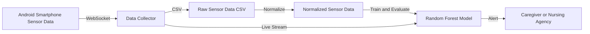

# Smartphone-Based Fall Detection System for the Elderly

## Introduction

Falls are a major risk for the elderly. This project presents a smartphone-based system that collects sensor data (accelerometer, gyroscope, etc.), processes it, and detects falls using a machine learning model. When a fall is detected, the system can trigger alerts to caregivers or agencies.

## System Overview

The system consists of:
- **Data Collection:** An Android device streams sensor data to a Python script (`extrair_dados.py`), which saves it to a CSV file. Falls are annotated in real time by pressing the spacebar.
- **Data Normalization:** The collected data can be normalized using `normalization.py`.
- **Model Training & Real-Time Detection:** `random_forest.py` trains a Random Forest classifier and connects to the sensor stream for real-time fall detection and alerting.

## Architecture Diagram


## Setup & Usage

### 1. Dependencies

- Python 3.x
- `websocket-client`
- `pynput`
- `scikit-learn`
- `pandas`
- `numpy`
- (Optional) `twilio` for phone call alerts

Install all dependencies:
```bash
pip install websocket-client pynput scikit-learn pandas numpy twilio
```

### 2. Data Collection

1. **Start the sensor data stream** from your Android device to the server (ensure the device and server are on the same network).
2. **Run the data collection script:**
    ```bash
    python extrair_dados.py
    ```
    - The script connects to the WebSocket server and writes sensor data to `sensor_data.csv`.
    - **To annotate a fall event, press and hold the spacebar** during the fall. The script will label those samples as falls (`falling=1`), otherwise as non-fall (`falling=0`).

### 3. Data Normalization (Optional)

Normalize the collected data for better model performance:
```bash
python normalization.py
```
- This creates `sensor_data_normalized.csv` with normalized features and a global norm column.

### 4. Model Training & Real-Time Detection

Train the Random Forest model and start real-time fall detection:
```bash
python random_forest.py
```
- The script trains a model using the CSV data.
- It then connects to the sensor stream and classifies incoming data in real time.
- If a fall is detected, it prints an alert and (optionally) can trigger a phone call via Twilio.

#### Twilio Alert Setup (Optional)

To enable phone call alerts:
- Set your Twilio credentials and phone numbers in `random_forest.py`:
  ```python
  account_sid = "<twilio account sid>"
  auth_token = "<twilio auth token>"
  TO_PHONE = "<phone to call>"
  FROM_PHONE = "<twilio phone number>"
  ```
- Uncomment the `make_call_alert()` line in `random_forest.py`.

## Configuration

- WebSocket server address is hardcoded in the scripts. Edit the URLs in `extrair_dados.py` and `random_forest.py` if needed.

## Expected Results

- The system should accurately detect falls with high precision and recall, minimizing false positives/negatives.
- Alerts are issued within seconds of a detected fall.
- All data is stored for further analysis and model improvement.

## References

- [SensorServer repository](https://github.com/umer0586/SensorServer) (conceptual inspiration)
- [WHO: Falls](https://www.who.int/news-room/fact-sheets/detail/falls)


